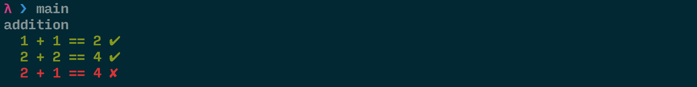

= C'est quoi le fonctionnel dans programmation fonctionnelle ?
:source-highlighter: pygments
:pygments-style: manni
:icons: font
:source-language: haskell
:samplesdir: ./samples
:2c: ::
:bq: `

Depuis quelques années maintenant la programmation fonctionnelle à le vent en poupe,
si comme moi vous êtes un javaiste vous avez vu l'arrivée des lambdas.
Mais Java (entre autre) reste attaché au paradigme objet.
Partons donc à l'aventure au pays des fonctions et des lambdas.

== Dis papa c'est quoi une lambda ?

Une lambda c'est tout simplement une fonction anonyme, ça passera mieux avec un exemple:

[source,java]
----
include::{samplesdir}/Lambda.java[]
----

Ici on utilise l'API Stream de Java 8 pour doubler chaque nombre du `Stream`.
`map` applique successivement la lambda `x -> x * 2` à chaque élément du `Stream`.

L'intérêt d'utiliser une lambda ici est de fournir un comportement à exécuter.
Comment et quand celui-ci sera appliqué dépendra de l'appelant (ici `map`).

== Les fonctions en Haskell

On va maintenant partir sur des exemples en https://www.haskell.org/[Haskell].
Pourquoi me direz-vous ?
Haskell est un langage fonctionnel et sa syntaxe me permettra de vous montrer quelque bienfait de la programmation fonctionnelle.

.Un peu de syntaxe 
[options="header", cols="1,1a,1a"]
|===
|Description | Code |Utilisation 

| une valeur
|
[source,haskell]
----
i :: Int
i = 42
----
|
[source,haskell]
----
λ> i
42
----

|une fonction
|
[source,haskell]
----
f :: String -> Int
f s = "Hello " ++ s
----
|
[source,haskell]
----
λ> f "World"
"Hello World"
----

|une fonction à plusieurs paramètres
|
[source,haskell]
----
add :: Int -> Int -> Int
add x y = x + y
----
|
[source,haskell]
----
λ> add 1 2
3
----

| une lambda
|
[source,haskell]
----
\x -> x * x
----
|
[source,haskell]
----
\λ> (\x -> x * x) 2
4
----
|===
[TIP]
J'utilise https://downloads.haskell.org/~ghc/latest/docs/html/users_guide/ghci.html[ghci] pour exécuter le code, c'est un REPL pour Haskell.

Haskell permet de __placer__ une fonction soit avant ses paramètres (postfix) ou entre (infix). 
Les fonctions alphanumériques seront postfix et celles dont le nom est un ou des symboles (`.`, `>>`) seront infix.
On peut intervertir leurs usages:

[cols="1,1a,1a"]
|===
||en postfix | en infix
|fonction postfix
|
[source,haskell]
----
add 1 2
----
|
[source,haskell]
----
1 `add` 2
----
|fonction infix
|
[source,haskell]
----
(.) f g
----
|
[source,haskell]
----
f . g
----
|===

== Un peu d'épice pour relevez le gout ?

Pour faire une lambda à plusieurs paramètres, on fait comme ceci : ``\x -> \y -> x + y``.
On a une lambda qui contient une lambda.
On vient ici de faire quelque chose de très intéressant, un petit indice d'abord ``\x -> (\y -> x + y)``.
Toujours pas ?
Alors je viens d'isoler la lambda `\y -> x + y`, ceci nous indique qu'une fonction peut en retourner une autre, on parle alors de **higher order function**.
On peut se dire qu'il s'agit :

* soit d'une fonction à *deux* paramètres retournant une valeur.
* soit d'une fonction à *un* paramètre retournant une fonction à *un* paramètre retournant une *valeur*.

Ce dernier concept s'appelle le **currying**, il consiste à considérer qu'une fonction n'aura toujours qu'un seul paramètre et une seule valeur de retour.
En fait une fonction à plusieurs paramètres c'est une fonction à un paramètre retournant une fonction à un paramètre et ainsi de suite jusqu'au résultat final.

La syntaxe Haskell permet nativement le currying :

[source,haskell]
----
include::{samplesdir}/concat.hs[]
-- dans le REPL:
λ> join "Hello " "World" -- <1>
"Hello World"
λ> greetings = join "Hello " -- <2>
λ> :t greetings
greetings :: String -> String -- <3>
λ> greetings "FP" -- <4>
"Hello FP"
λ> greetings "Currying"
"Hello Currying"
----

<1> on l'utilise normalement
<2> on ne passe que le premier argument et on assigne la fonction restante
<3> la fonction restante est ``String -> String`` : c'est ce qu'on attendait (dans le REPL `:t` nous donne le type d'une valeur)
<4> on peut utiliser la nouvelle fonction comme n'importe quelle autre

Lorsque l'on ne passe pas tous ces arguments à une fonction on dit qu'on l'**applique partiellement**

[TIP]
====
Accessoirement, pour avoir une lambda à plusieurs paramètres on peut tout à fait l'écrire ``\x y -> x + y``, c'est juste du sucre syntaxique.
====

== Une fonction dans la fonction

Vous vous souvenez du premier exemple en Java ? 
On passait une lambda à la fonction `map`, il s'agit aussi d'une **higher order function**: on passe une fonction comme paramètre d'une autre.

Un petit exemple en haskell bien entendu:

[source,haskell]
----
λ> map (\x -> x * 2) [1,2,3]
[ 2, 4, 6 ]
----

On entoure la lambda de parenthèses sinon le compilateur ne saura pas où elle s'arrête !
`[1,2,3]` est la liste d'entier.

Si vous voulez faire vos propres fonctions prenant une (ou des, soyons fous) fonction il faut feinter, regardons la signature de `map`:

[source,haskell]
----
λ> :t map
map :: (a -> b) -> [a] -> [b]
----

Il faut, une nouvelle fois, cerner la fonction avec des parenthèses.
`map` est donc une fonction prenant une fonction (de type `a -> b`) et une liste puis retourne une liste.

[NOTE]
====
Les `a` et `b` dans la signature ne sont pas des variables mais des types polymorphes, cela veut dire que l'on pourra les remplacer par n'importe quel type.
====

== Une fonction plus une fonction égale... une fonction

Dans tout projet de développement, on cherche à faire des éléments (objet, procédure, fonction...) petit et composable.
Personnellement je vois ça comme des lego, des centaines de petites pièces qui ne peuvent rien seule, mais dés qu'on les assemble comme il faut on peut obtenir ce qu'on veut.

On peut également composer des fonctions, on a alors une nouvelle fonction:

[source,haskell]
----
λ> greetings s = "Hello " ++ s
λ> reverseGreet s = (greetings . reverse) s
λ> reverseGreet "dlrow"
"Hello world"
----

Ce qui nous intéresse ici c'est la fonction `.` (lisez _compose_), voici sa signature: `(b -> c) -> (a -> b) -> a -> c`.
On voit qu'elle prend 3 fonctions en paramètres et retourne une fonction une valeur de type (polymorphe) `c`, que se passe t-il à l'intérieur ?

. elle passe son paramètre de type `a` à la fonction `a -> b` (le deuxième paramètre de `.`)
. la valeur produite, de type `b`, est alors fourni à la fonction `b -> c` qui produit le résultat final

[TIP]
====
Pourquoi appeler la fonction de composition `.` ?
Parce qu'en notation mathématique la composition s'écrit `∘`
====

L'ordre peut paraître contre intuitif, mais implémentons notre propre fonction `compose`:

[source,haskell]
----
include::{samplesdir}/compose.hs[]

-- à l'éxécution
λ> greetings s = "Hello " ++ s
λ> (compose greetings reverse) "dlrow"
"Hello world"
----

Dans notre exemple, comment fait on pour composer ? 
On applique nos fonctions dans une lambda: `\x -> g (f x)` et là on retrouve l'ordre de nos paramètres,
d'abord `f x` puis son résultat est passé à `g`.

== Libérez les paramètres

Pour construire la fonction `reverseGreet` qu'a t'on fait ?

[source,haskell]
----
reverseGreet :: String -> String
reverseGreet s = (greetings . reverse) s
----

On indique que l'on a un paramètre `s` auquel on applique la fonction (composée) ``(greetings . reverse)``.
Maintenant rappelez vous deux choses:

* le type de `.` c'est `(b -> c) -> (a -> b) -> a -> c` 
* une fonction peut en retourner une

Donc si au lieu de dire 

> `.` est une fonction à trois paramètres: deux fonctions et une valeur de type `a` retournant une valeur de type `c`

on disait

> `.` est une fonction prenant deux fonctions et retournant une fonction, comme ceci `(b -> c) -> (a -> b) -> (a -> c)`

Alors on pourrait écrire `reverseGreet` comme ceci

[source,haskell]
----
reverseGreet :: String -> String
reverseGreet = greetings . reverse
----

Plus de paramètres !
Rien de magique la dedans, encore moins d'une fonctionnalité d'Haskell, il faut vraiment voir les fonctions comme des valeurs.
Au final ce qu'on veut c'est qu'en face du nom `reverseGreet` il y est une expression de type `String -> String` et `greetings . reverse` convient tout à fait.
Il n'y a donc pas besoin d'indiquer explicitement un paramètre.

Ce style de notation est dit https://wiki.haskell.org/Pointfree[**point free**], on n'écrit plus les paramètres on décrit plutôt le flux de transformation des données.

== Mon framework de test à moi

Pour finir je vous propose un mini framework de test en Haskell:

[source,haskell]
----
include::{samplesdir}/test.hs[]
----

<1> On défini un **type alias**: `UnitTest` est un synonyme pour le type `() -> (Bool, String)` soit une fonction qui produira une paire contenant un `Bool` et une `String`.
Le `()` est le tuple vide: un type `()` ayant pour seule valeur `()` (oui c'est troublant au début).

<2> Une valeur de type `UnitTest` doit être une fonction, la fonction `test` retourne donc une lambda.
Le `let ... in` est une expression qui permet de définir des calculs intermédiaires et de les nommer (plutôt que d'avoir un illisible __one-liner__)
Vous remarquerez que pour éxécuter le test on lui passe la valeur `()`.

<3> On applique partiellement `map` avec juste une lambda, on obtient alors une fonction `[UnitTest] -> [(Bool,String)]`.
Vous avez vu ? `UnitTest` est une fonction, on peut donc également construire des listes de fonctions !

<4> Le `$` est une fonction (`($) {2c} (a -> b) -> a -> b`) qui passe la valeur à sa droite à la fonction à sa gauche, c'est un moyen pratique d'éviter ceci : `(map format . runTests) tests`.
Ici on passe la valeur `tests` à la fonction composée `map format . runTests`.

<5> la fonction `:` (`(:) {2c} a -> [a] -> [a]`) ajoute une valeur au début d'une liste.

<6> Un exemple de http://lyah.haskell.fr/syntaxe-des-fonctions#filtrage-par-motif[**pattern matching**].

On a ici un mini-framework de test (certes limité) en quelque lignes.
Vous pourrez constatez qu'on se base juste sur la syntaxe et des fonctions (et du pattern matching mais difficile de s'en passer).

Ci-dessous un exemple d'éxécution:

== Function for ever

On a vu que dans un langage fonctionnel, une fonction est une valeur que l'on peut aisément manipuler. 
La programmation fonctionnelle propose un nouveau challenge car on change de paradigme, 
au délà d'apprendre une nouvelle syntaxe il faut réussir à penser en terme de fonction: quand les injecter, les enchainer...

Je vous encourage vivement à apprendre la programmation fonctionnelle (avec Haskell en particulier, car vous serez contraint d'utiliser ce paradigme),
pour vous améliorez en tant que développeur.
Même si je continues à coder en Java au jour le jour, j'essaye de rendre mes fonctions le plus pure possible pour séparer aisément les calculs des effets.
